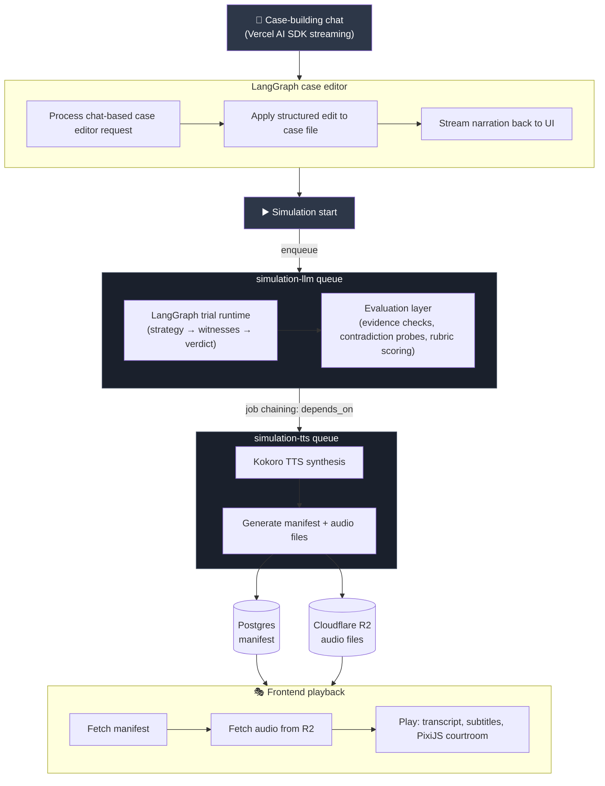
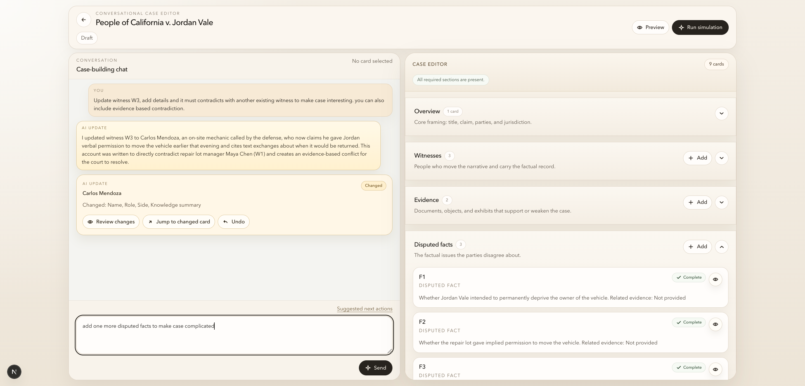
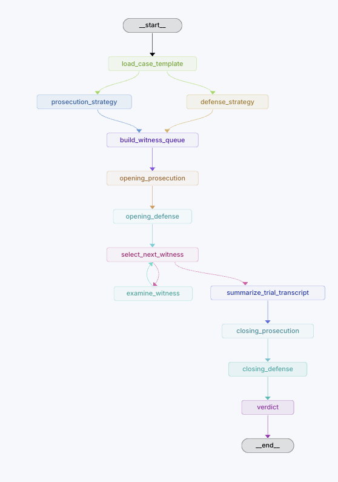
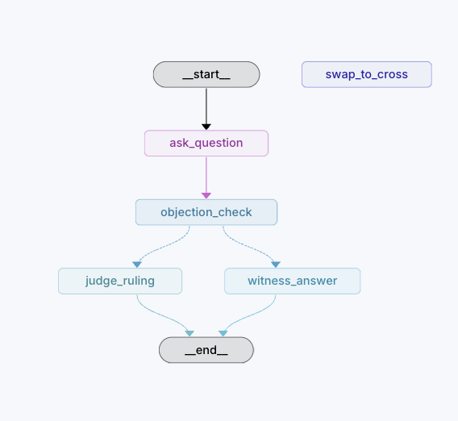
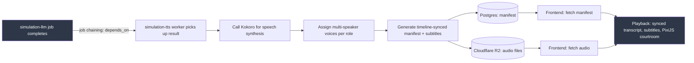
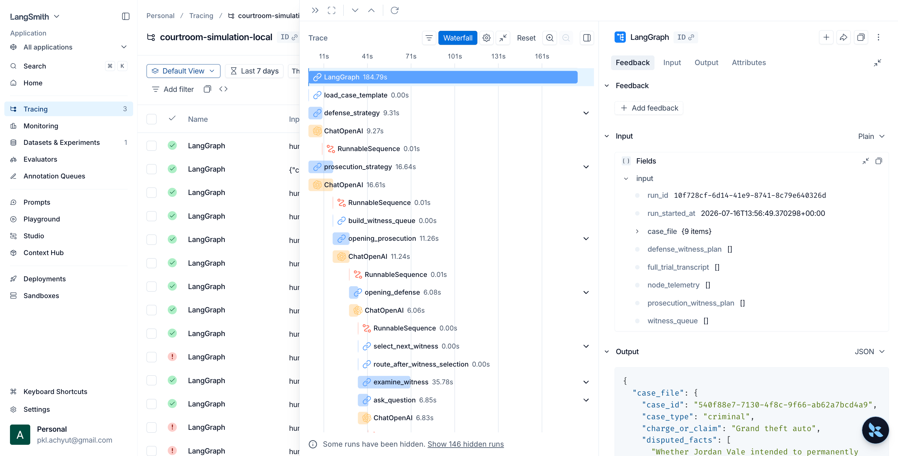

# Courtroom Simulation

[](https://github.com/lf-achyutpkl/courtroom/actions/workflows/python-package.yml)


AI courtroom simulation built with `LangGraph`, `FastAPI`, `Next.js`, and `RQ`. It generates evidence-grounded trials, renders spoken verdicts with `Kokoro` TTS, and turns the result into a replayable courtroom experience.

`LangGraph` • `multi-agent orchestration` • `RAG-grounded reasoning` • `evaluation pipeline` • `async workers` • `Kokoro TTS` • `PixiJS playback`

> ⚖️ **v2.0 coming: from playback to live practice**
>
> V2 turns this into a live, voice-driven courtroom training loop: you argue your case out loud in real time — live STT for your side, live TTS for the opposing counsel and judge — against an LLM-powered opponent, with the whole exchange unfolding as a genuine live discussion rather than a scripted run. An LLM judge delivers the verdict on the spot, and the system returns structured feedback on argument quality, performance, strengths, and weaknesses.

## 🎬 Case Builder Demo

<details>
<summary>Expand to watch the case builder demo</summary>

### Case Builder Walkthrough

<video src="https://github.com/user-attachments/assets/de5ce54a-cff3-4042-8f96-7353098664a8" controls muted preload="metadata"></video>

</details>

## 🎬 Running Simulation Demo

<details>
<summary>Expand to watch the simulation demo</summary>

### Running Simulation Walkthrough

<video src="https://github.com/user-attachments/assets/1b34fecf-52ce-4a44-a10d-a17b1340984d" controls preload="metadata"></video>

</details>

---

## 🔎 System Flow

Two RQ queues are chained by job dependency: `simulation-tts` only starts once `simulation-llm` finishes, and picks up its result directly rather than re-reading it from scratch.



- `Simulation start` enqueues a single job onto the `simulation-llm` queue.
- The `simulation-llm` job runs the LangGraph trial runtime end-to-end, then the evaluation layer scores the transcript before the job is marked complete.
- The `simulation-tts` job is chained to depend on `simulation-llm` — RQ only starts it once the LLM job succeeds, and it consumes that job's result directly instead of re-fetching it.
- All audio concerns — timeline sync, subtitle timing, multi-speaker voice assignment — are resolved during the `simulation-tts` stage. Nothing audio-related happens on the frontend beyond fetching and playing already-synced assets.

## 🧠 Case File Generation



Case creation starts in a conversational editor, not a raw form.

- The frontend exposes a chat-first case editor with a synchronized card-based workspace for case metadata, witnesses, evidence, and disputed facts.
- Chat messages are sent to a case-editor endpoint, along with the currently selected card when the user wants to focus a specific item.
- The chat UI is built on the **Vercel AI SDK**, streaming the case editor's narration back to the timeline as it's generated instead of waiting for the full response.
- The LangGraph case editor runs a two-step flow:
  - `process_edit` interprets the user request and converts it into a typed case edit result
  - `narrate` turns that edit into a short natural-language update for the chat timeline
- The backend applies edits against the stored case file revision instead of treating the chat transcript as the source of truth.
- The UI reflects structured diffs, jump-to-change actions, review actions, and undo support around AI-generated edits.

This keeps the case-building flow grounded in the saved case file while still letting the user work conversationally.

## ⚖️ Trial Graph

The trial runtime is implemented as a LangGraph state graph with explicit phases and routing. The Mermaid diagram stays as the primary reference because it is easy to diff and keep synchronized with code, while the Studio-exported images below provide a quick visual check of the actual graph shape.

*Image: Trial graph* </br>


*Image: Examine witness subgraph*  </br>


- `prosecution_strategy` and `defense_strategy` run in parallel after the case template is loaded, then join before witness queue construction.
- Witness handling is delegated into the `examine_witness` witness subgraph instead of flattening examination logic into the main trial graph.
- The witness subgraph routes through question asking, objection checks, judge rulings, witness answers, and cross-examination swaps with conditional edges.
- The graph composes deterministic orchestration with structured model outputs at each node.

## 🔊 Audio Pipeline (Kokoro TTS)

Audio generation is a fully separate, chained stage — not something bolted onto the frontend.



- Once `simulation-llm` completes, RQ's job-chaining pattern (`depends_on`) triggers `simulation-tts`, which reads the completed job's result directly rather than re-querying it.
- `simulation-tts` calls **Kokoro** to synthesize speech for each line of the trial transcript.
- Multi-speaker voice assignment, subtitle timing, and timeline sync are all resolved during this stage — the frontend does none of that work, it only plays already-synced output.
- The stage produces two artifacts:
  - a **manifest** (per-line audio references, timestamps, speaker labels) persisted to **Postgres**
  - the rendered **audio files**, uploaded to **Cloudflare R2** object storage
- The frontend fetches the manifest, pulls the referenced audio from R2, and drives the PixiJS courtroom presentation and subtitles purely from manifest data.

## 🎯 Core AI Capabilities

| Capability | Current implementation |
| --- | --- |
| Case-building flow | LangGraph case editor that converts chat requests into typed case-file mutations |
| Multi-agent trial flow | LangGraph runtime for strategy planning, witness examination, rulings, closings, and verdicts |
| Subgraph composition | Dedicated witness examination subgraph with conditional routing |
| Parallel node execution | Prosecution and defense strategy nodes run in parallel before the trial continues |
| Evidence grounding | Verdict and transcript logic use case evidence and tracked evidence IDs |
| Structured outputs | Pydantic-shaped model outputs with node-level token controls |
| Evaluation | Dataset-backed checks for evidence support, contradiction handling, verdict support, and unsafe or unsupported claims |
| Adversarial testing | Manual `promptfoo` suite for role confusion, contradiction injection, malformed evidence references, and unsafe prompts |
| Observability | Optional LangSmith tracing plus evaluation reports written to `apps/agent-service/evals/reports/` |

## ⚙️ System Design

### AI runtime

- `apps/agent-service` owns the LangGraph simulation runtime, the case editor graph, prompts, evaluation logic, and baseline/adversarial testing.

### API and worker orchestration

- `apps/api-service` owns the FastAPI boundary, persistence, and the Redis/RQ queues — `simulation-llm` and `simulation-tts` — chained via RQ's job-dependency pattern, plus the case-file message boundary used by the editor.

### Frontend

- `apps/web-app` owns the conversational case editor, card-based case workspace, simulation browsing, and the courtroom playback UI built on Next.js and PixiJS.

### Shared domain layer

- `packages/python-domain` holds shared Python domain models used across services.

## 🎙️ Product Surface

The current frontend exposes two main engineering surfaces:

- a conversational case editor with structured case-file cards and simulation readiness checks
- a simulation playback view with transcript, metadata, and staged courtroom presentation

The case editor and playback views are separate flows connected by the stored case file and simulation run contracts.

## ✅ AI Evaluation And Safety Posture

- Seeded baseline evaluations run against a domain dataset in `apps/agent-service/evals/domain_evaluation_dataset.json`.
- Rule-based evaluators check evidence references, verdict support, contradiction probes, unsupported claims, and required trial phases.
- A manual `promptfoo` suite exercises adversarial scenarios such as role confusion and contradiction injection.
- Rubric scoring can use an LLM judge to assess legal grounding, procedural realism, role adherence, contradiction handling, verdict support, and unsafe-content handling.
- Queue review records can be created for failures, severe alerts, and sampled runs.



## 🛠️ Tech Stack

| Area | Tools |
| --- | --- |
| AI orchestration | `LangGraph`, `LangChain`, `OpenAI` models |
| Evaluation | `promptfoo`, rubric evaluators, optional `LangSmith` tracing |
| Audio | `Kokoro` TTS, timeline-synced manifest generation, multi-speaker voice assignment |
| Backend | `FastAPI`, `SQLAlchemy`, `Postgres`, `Redis`, `RQ`, `Python` |
| Storage | `Postgres` (manifests), `Cloudflare R2` (audio files) |
| Frontend | `Next.js`, `React`, `TypeScript`, `PixiJS`, `Vercel AI SDK` |
| Dev workflow | `Docker Compose`, `Make`, `uv`, `pnpm` |

## 🚀 Run It Locally

### Fastest path

```bash
cp apps/web-app/.env.example apps/web-app/.env
cp apps/api-service/.env.example apps/api-service/.env
cp apps/agent-service/.env.example apps/agent-service/.env
docker compose up --build
```

Main endpoints:

- Web app: `http://localhost:3000`
- API service: `http://localhost:8000`

### Workspace commands

```bash
make web-dev
make api-dev
make agent-dev
make worker
```

## 📁 Repository Shape

```text
apps/
  agent-service   LangGraph runtime, case editor, prompts, evals
  api-service     FastAPI API, Redis/RQ workers, persistence
  web-app         Case editor, simulation library, courtroom playback
packages/
  python-domain   Shared Python domain models
```

## 📌 Roadmap

- Add live human-vs-model courtroom mode for V2
- Return structured post-trial coaching on persuasion, evidence use, and weaknesses
- Expand simulation-run browsing and review workflows
- Harden observability and review tooling around failed or low-quality runs
